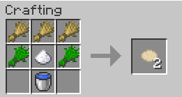
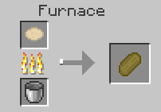

# Herbacraft - another Minecraft mod
## Supported Versions
Minecraft 1.16.5 (Forge 36)

## Overview
Herbacraft is agriculture-focused. It adds crops and products into the game.

You grow special crops, the seeds of which can be found in chests or in fossils, in the stone underground.

You yield the crops and they all have special products that have special uses.

## Herbs
**NOTE:** More herbs are to be added, this is a list of currently implemented herbs.
### Cannabis
Cannabis is, well, cannabis. You can dry the cannabis flower, or use the cannabis flower to make dough. This dough can be baked into medicated bread, which gives you the Stimulated effect for 5 minutes, and takes away 5 hunger bars.

